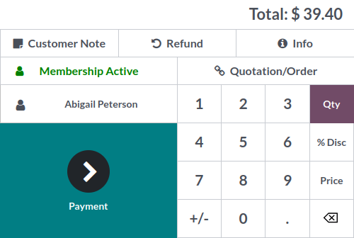

# Membership Status Alltogo

This module displays a field that gives the user information on the current status of the
membership of the buyer. 
It is a simple owl module that makes a connection to the backend server
and gets the information needed.

It should be noted that this module depends on another custom module called
"customer_membersip_management".

